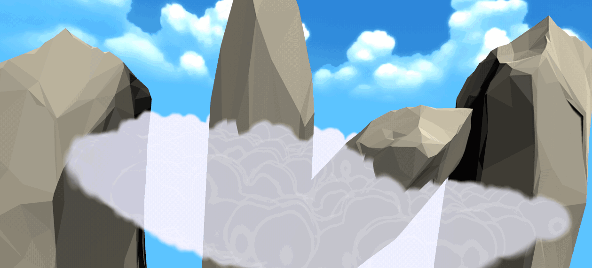
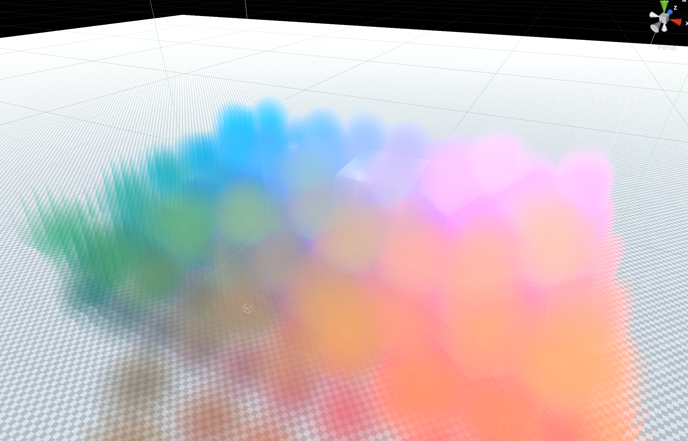
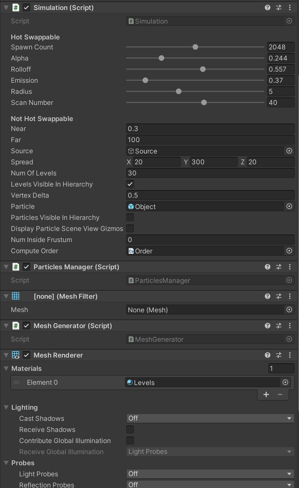

# SimChop (beta, version 0.8.0)
#### &copy; Dr. Russell Campbell, and Eli Landa
##### Vancouver Island University, Nanaimo, British Columbia, Canada

|  |  |
|---|---|

 

## Volumetric/Particle System

SimChop is an open source project ([MIT License](LICENSE)) demonstrating a real-time volumetric/particle system in Unity 2020 LTS.

Specifications:

* most recent setup uses Unity version 2020.3.14f1 (but any 2020 LTS version should be fine)
* a GPU---so far, tested on NVIDIA:
    * GTX 1080TI
    * GeForce RTX 2060
    * GeForce RTX 3070 

We plan to continue development for the next Unity LTS release making use of DOTS to extend SimChop to allow for tens-of-thousands of shaded Unity Physics Sphere Colliders.

Imagine games with real-time flows/pools of *interactive* water, or manipulable fogs controlled by the player, fuzzy portals, highly dynamic force fields that react to their environment, etc.

The different use cases are quite diverse and we would be excited to see your adaptations of our system! Join the [SimChop Discord](https://discord.gg/N2yPtpFYpE) server where you can show off your shader skills, or get a bit of help with the configurations of SimChop.

 

 

## SimChop Summary

Particles are managed with Sphere Colliders. Their positions are passed into shaders to produce volumetric Voronoi-like effects.

The system is still fairly early in development, but a few demo scenes are included in the project to help see some examples of configurations that are more stable.

The `InterleavingDemo` scene includes a most basic setup of game objects to have particles consistently flow throughout an area:

* Box Colliders on a Terrain for walls to hold particles inside
* another Box Collider `Sink` that teleports particles back to a `Source` when particles enter it   
(this keeps particles flowing through an area to avoid them settling and then locking motion)
* a Player object with a child `InterleavedVolume` that generates "level-surface" geometry to display the shaded particles
* each particle is a prefab that includes:
    * a Rigidbody for Physics interaction
    * a Sphere Collider with a `radius` control and `PhysicMaterial`
    * a `MoveParticle` script that applies a force once per second  
    (adapt its formulae for applying forces as needed)

 

 

## `InterleavedVolume` Controls

The Inspector for a game object that has the script `Simulation` added as a component (e.g., `InterleavedVolume` in the `InterleavingDemo` Scene) will give many controls.

An example of some reasonable settings for fog in the `InterleavingDemo` Scene that avoid most artefacts:

At least for early versions, the particle prefab Sphere Collider radius needs to match closely with the `Radius` for shader display. This helps avoid particles popping in and out of view (henceforth called "flicker").

The system obviously handles a lower number of particles fairly well, and debugging/testing is ongoing for more. You can still try to add more than 2048 particles, but the configuration for `Radius` and increasing the `Scan Number` *may* help reduce flicker. It is possible to set options so that 4096 particles can get about 30 fps on higher-end graphics cards.

You may have more powerful graphics hardware and know how to use it. The system will still work if you hard code a change to the `MAX_PARTICLES` constant in `Simulation.cs`. Although nothing crashed with testing 32768 particles, the fps with NVIDIA GeForce RTX 3070 was around 0.5.

A few configurations that have been tested to stress the system and still mostly avoid flicker:

| `Radius` (`Simulation.cs`) | `Radius` (collider) | `Num Of Levels` | `Scan Number` | `Spawn Count` |
|----|----|----|----|----|
| 10 | 8.5 or more | 30 | 70 | 4096 |
| 5.125 | 4 or more | 30 | 48 | 4096 |
| 2 | 2 | 30 | 30 | 4096 |

The above test were done with `Near = 0.3` and `Far = 100`.

It helps if the difference between the radii are whole numbers with a fractional perfect division of two, so linear combinations of 1, 0.5, 0.25, 0.125, etc. Start with the collider radius just a bit lower than you would like, and add on as needed until flicker is almost eliminated. Then increase the `Scan Number` slightly to get rid of the last bit of flicker. 

Note that in the Editor, you will have faster frame rates when the Game View is docked in the same window as the Scene View.

The volume covering the camera depends on the aspect ratio of the window it displays inside&mdash;and the correct geometry to fit the camera view is generated at the start of play. Therefore, you will need to restart play to have the particles properly display if you need a different-sized window. If you forget to do this, you will see artefacts of geometry lines near the edge of the window. This is also an issue if you change the particle display radius from smaller to larger.

 

 

## `Levels` Material and `RipplingFog` Shader

The basic shader magic is done in `SimChop/RipplingFog.shader`.

It includes a `BinarySearch.cginc` that organizes the Texture3D lookups. The data structure follows the design of an octree, but no linking of cells needs to be passed in, since we order the particle positions based on Morton codes and then use binary search.

The volume that an octree covers tends to be restricted to an exact halving some finite number of times, but we scale between these discrete halvings with the setup and calculations in `Simulation.cs`.

The volume of interest in the scene that covers the particles to render have the positions mapped to a unit cube in the first octant (all x, y, z values are between 0 and 1).

The Morton codes then perform lookup by scaling a requested location in the unit cube up to a cube of sidelength some power of 2. The `precision` controls this scaling and is calculated to fit the desired radius and cover the volume in view as closely as possible. The same scaling has to be done in the shaders for the particles to be quickly found out of thousands for those that are closest.

